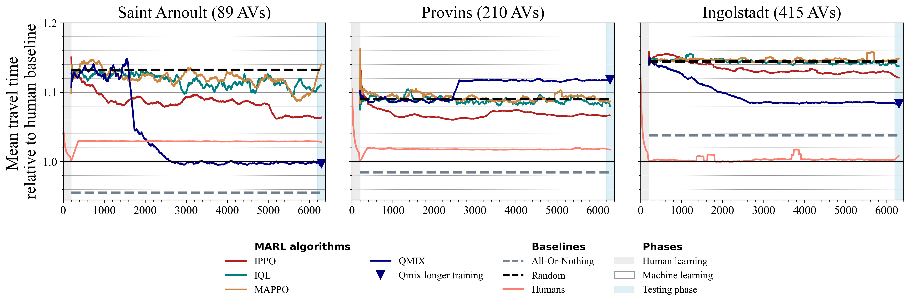
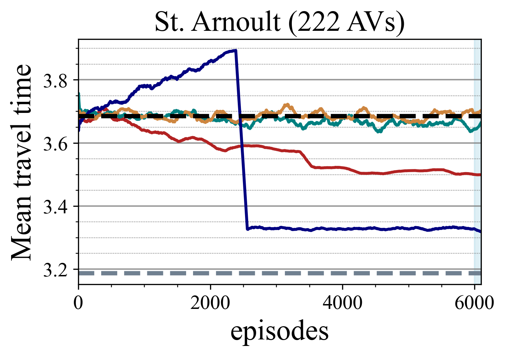
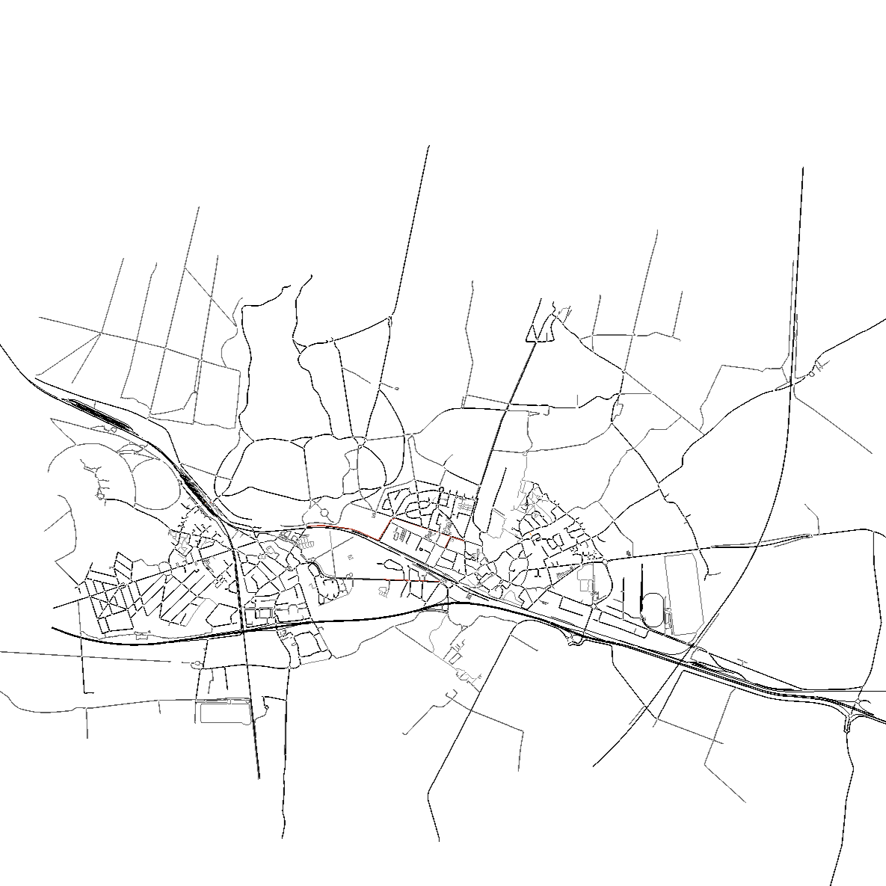
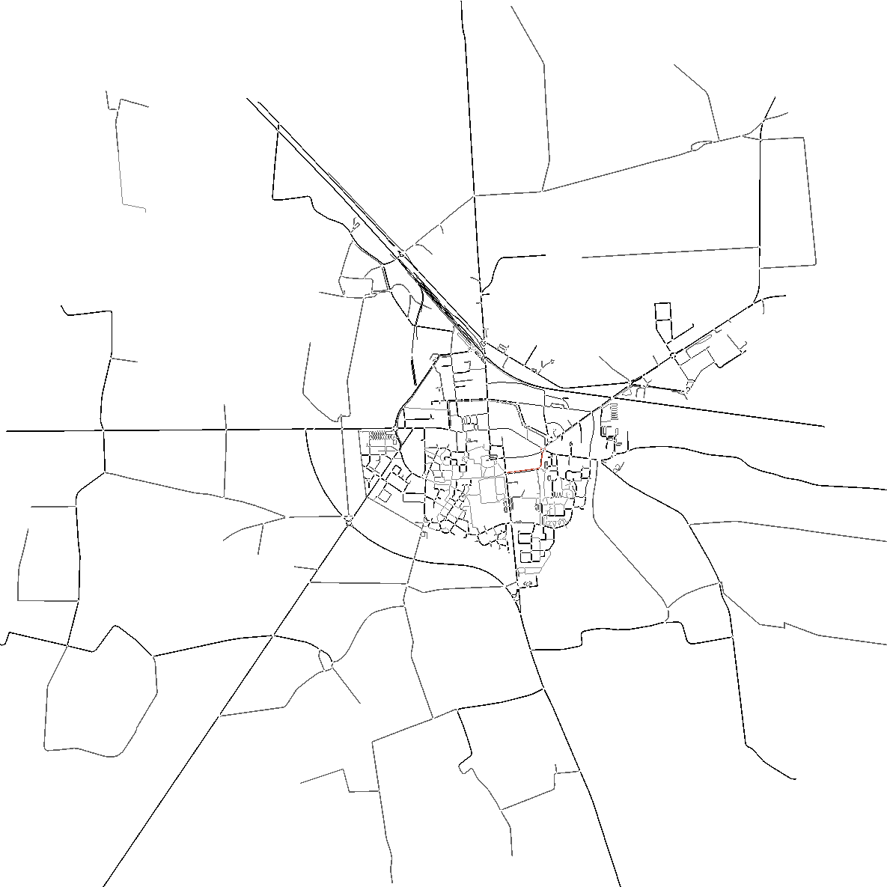
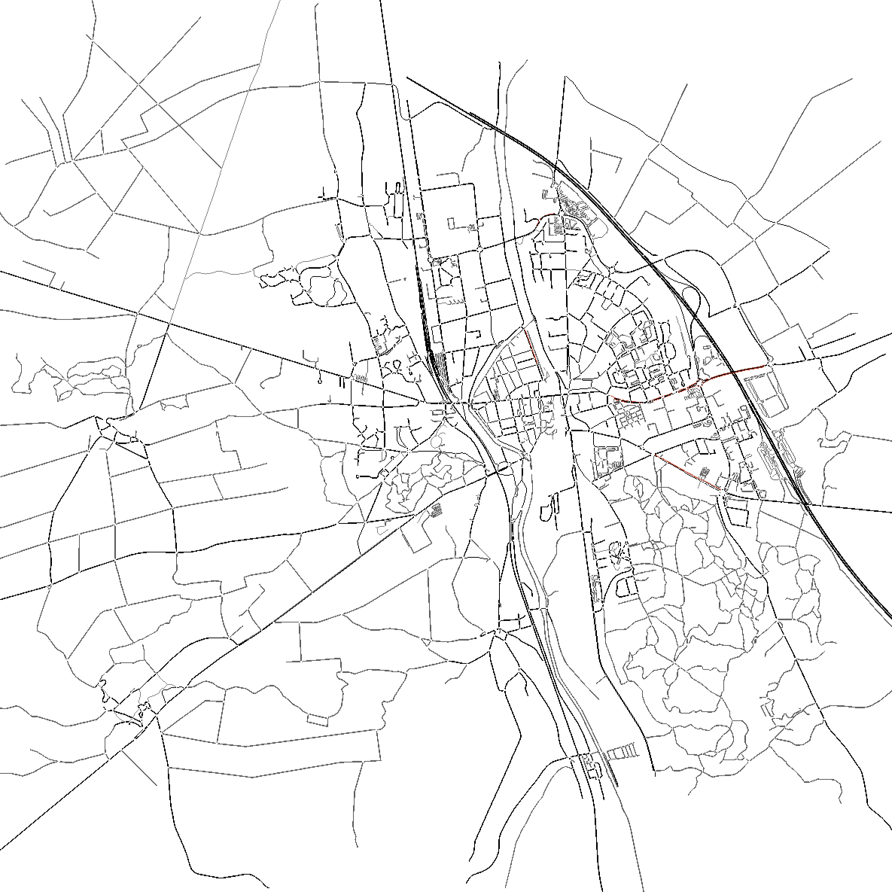
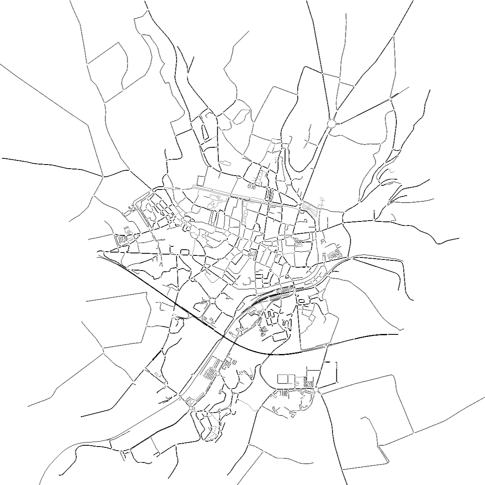

<p align="center">
  
</p>

# Urban Routing Benchmark: Benchmarking MARL algorithms on the fleet routing tasks

<p align="center">
  
</p>

Connected Autonomous Vehicles (CAVs) promise to reduce congestion in future urban networks, potentially by optimizing their routing decisions. Unlike for human drivers, these decisions can be made with collective, data-driven policies, developed by machine learning algorithms. Reinforcement learning (RL) can facilitate the development of such collective routing strategies, yet standardized and realistic benchmarks are missing. To that end, we present `URB`: Urban Routing Benchmark for RL-equipped Connected Autonomous Vehicles. `URB` is a comprehensive benchmarking environment that unifies evaluation across 29 real-world traffic networks paired with realistic demand patterns. `URB` comes with a catalog of predefined tasks, five state-of-the-art multi-agent RL (MARL) algorithm implementations, three baseline methods, ten domain-specific performance metrics, and a modular configuration scheme. Experimental results initiate the first leaderboard for MARL in large-scale urban routing optimization and reveal that current approaches struggle to scale, emphasizing the urgent need for advancements in this domain.

Via the broad experimental scheme, `URB` aims to:

1) understand which state-of-the-art algorithms outperform others in this class of tasks,
2) open competition for future algorithmic improvements,
3) better understand impact of collective CAV routing for future cities (on congestion, emissions and sustainability) to equip policymakers with solid arguments for CAV regulations.

---

## 🔎 Results

> **Task:** In a given network with a fixed demand pattern, experienced human agents have learned their route-choice strategies (minimized travel times). At some point, a given share of them _mutate_ to CAVs and delegate routing decisions. Then, for a given number of training episodes, the agents develop routing strategies to minimize their delay using MARL.

**Travel times relative to human baseline ($t^{pre}$) across episodes in 3 instances (90 to 420 agents)**. Baselines are marked with dashed lines, human travel times with a solid black line and four tested RL algorithms with color lines. We pick the best out of three runs. Algorithms are trained for 6000 episodes (days simulated in SUMO), and QMIX (as the most promising) for 20000 (blue triangle). Many algorithms hardly beat the random baseline and stabilize, most stop learning. In Provins and Inglostadt, none of the algorithms managed to beat the human baseline and only QMIX on the smallest instance (St. Arnoult) managed to beat human travel times (in 2 out of 3 runs).

<p align="center">
  
</p>

#### Simulation results for 4 algorithms and 3 baselines in _St. Arnoult_ for 40% AVs

| **Algorithm** | ${t^{\text{\textbf{pre}}}}$ | ${t^{\text{\textbf{test}}}}$ | ${t_{\text{\textbf{CAV}}}}$ | ${t_{\text{\textbf{HDV}}}^{\text{\textbf{post}}}}$ | ${c_{\text{\textbf{all}}}}$ | ${c_{\text{\textbf{HDV}}}}$ | ${c_{\text{\textbf{CAV}}}}$ | ${\Delta_{\text{\textbf{V}}}}$ | ${\Delta_{\text{\textbf{l}}}}$ | ${\text{\textbf{WR}}}$ |
|------------------|--------------------------------|---------------------------------|--------------------------------|-------------------------------------------------------|--------------------------------|--------------------------------|--------------------------------|-----------------------------------|-----------------------------------|---------------------------|
| IPPO             | 3.15                           | 3.28                            | 3.34                           | 3.24                                                  | 0.6                            | 0.12                           | 1.33                           | -0.31                             | 0.05                              | 0\%                       |
| IQL              | 3.15                           | 3.34                            | 3.49                           | 3.24                                                  | 0.66                           | 0.14                           | 1.44                           | -0.42                             | 0.08                              | 0\%                       |
| MAPPO            | 3.15                           | 3.32                            | 3.43                           | 3.25                                                  | 0.66                           | 0.14                           | 1.45                           | -0.27                             | 0.08                              | 0\%                       |
| QMIX             | 3.15                           | 3.2                             | 3.12                           | 3.25                                                  | 0.65                           | 0.13                           | 1.43                           | -0.2                              | 0.01                              | 66\%                      |
| Human            | 3.15                           | 3.15                            | 3.15                           | 3.15                                                  | 0.0                            | 0.0                            | 0.0                            | 0                                 | 0.0                               | 100\%                     |
| AON              | 3.15                           | 3.15                            | 3.01                           | 3.25                                                  | 0.55                           | 0.09                           | 1.21                           | -0.06                             | -0.0                              | 100\%                     |
| Random           | 3.15                           | 3.38                            | 3.58                           | 3.25                                                  | 0.6                            | 0.09                           | 1.36                           | -0.33                             | 0.1                               | 0\%                       |

#### Simulation results for 4 algorithms and 3 baselines in _Provins_ for 40% AVs

| **Algorithm** | ${t^{\text{\textbf{pre}}}}$ | ${t^{\text{\textbf{test}}}}$ | ${t_{\text{\textbf{CAV}}}}$ | ${t_{\text{\textbf{HDV}}}^{\text{\textbf{post}}}}$ | ${c_{\text{\textbf{all}}}}$ | ${c_{\text{\textbf{HDV}}}}$ | $\{c_{\text{\textbf{CAV}}}}$ | ${\Delta_{\text{\textbf{V}}}}$ | ${\Delta_{\text{\textbf{l}}}}$ | ${\text{\textbf{WR}}}$ |
|---------------|----------------------------|------------------------------|-----------------------------|----------------------------------------------------|-----------------------------|-----------------------------|------------------------------|--------------------------------|--------------------------------|------------------------|
| IPPO          | 2.8                        | 2.88                         | 2.92                        | 2.85                                               | 0.53                        | 0.26                        | 0.93                         | -0.4                           | 0.03                           | 0\%                    |
| IQL           | 2.8                        | 2.92                         | 3.03                        | 2.84                                               | 1.48                        | 0.98                        | 2.23                         | -0.52                          | 0.06                           | 0\%                    |
| MAPPO         | 2.8                        | 2.92                         | 3.03                        | 2.85                                               | 1.23                        | 0.81                        | 1.87                         | -0.64                          | 0.06                           | 0\%                    |
| QMIX          | 2.8                        | 2.96                         | 3.14                        | 2.85                                               | 0.88                        | 0.54                        | 1.41                         | -0.8                           | 0.07                           | 0\%                    |
| Human         | 2.8                        | 2.8                          | 2.8                         | 2.8                                                | 0.0                         | 0.0                         | 0.0                          | 0.0                            | 0.0                            | 100\%                  |
| AON           | 2.8                        | 2.81                         | 2.76                        | 2.84                                               | 0.47                        | 0.19                        | 0.99                         | -0.14                          | -0.0                           | 100\%                  |
| Random        | 2.8                        | 2.93                         | 3.04                        | 2.85                                               | 0.51                        | 0.22                        | 0.95                         | -0.62                          | 0.06                           | 0\%                    |

#### Simulation results for 4 algorithms and 3 baselines in _Ingolstadt_ for 40% AVs

| **Algorithm** | ${t^{\text{\textbf{pre}}}}$ | ${t^{\text{\textbf{test}}}}$ | ${t_{\text{\textbf{CAV}}}}$ | ${t_{\text{\textbf{HDV}}}^{\text{\textbf{post}}}}$ | ${c_{\text{\textbf{all}}}}$ | ${c_{\text{\textbf{HDV}}}}$ | ${c_{\text{\textbf{CAV}}}}$ | ${\Delta_{\text{\textbf{V}}}}$ | ${\Delta_{\text{\textbf{l}}}}$ | ${\text{\textbf{WR}}}$ |
|------------------|-----------------------------|------------------------------|-----------------------------|----------------------------------------------------|-----------------------------|-----------------------------|-----------------------------|--------------------------------|--------------------------------|------------------------|
| IPPO             | 4.21                        | 4.4                          | 4.72                        | 4.18                                               | 1.76                        | 1.22                        | 2.56                        | -0.37                          | 0.07                           | 0\%                    |
| IQL              | 4.21                        | 4.45                         | 4.8                         | 4.22                                               | 1.68                        | 1.08                        | 2.59                        | -0.62                          | 0.07                           | 0\%                    |
| MAPPO            | 4.21                        | 4.44                         | 4.81                        | 4.2                                                | 1.82                        | 1.21                        | 2.75                        | -0.62                          | 0.07                           | 0\%                    |
| QMIX             | 4.21                        | 4.36                         | 4.55                        | 4.23                                               | 1.2                         | 0.67                        | 1.98                        | -0.73                          | 0.02                           | 0\%                    |
| Human            | 4.21                        | 4.21                         | 4.21                        | 4.21                                               | 0.0                         | 0.0                         | 0.0                         | 0.0                            | 0.0                            | 100\%                  |
| AON              | 4.21                        | 4.29                         | 4.37                        | 4.23                                               | 0.87                        | 0.55                        | 0.24                        | -0.45                          | -0.01                          | 0\%                    |
| Random           | 4.21                        | 4.45                         | 4.81                        | 4.22                                               | 0.99                        | 0.49                        | 1.74                        | -0.68                          | 0.07                           | 0\%                    |


### 100% AVs

<p align="center">
  
</p>


---

## 🔗 Workflow

`URB` (as depicted in the above figure):
* Runs an experiment script using the `TrafficEnvironment` from `RouteRL`,
* With a RL algorithm (possibly `TorchRL` implementation) or a baseline method (from `baseline_models/`),
* Opens algorithm, environment and task configuration files from `config/`,
* Loads the network and demand from `networks`
* Executes a typical `RouteRL` routine of
   * first learning of human drivers,
   * which then 'mutate` to CAVs,
   * are trained to optimize routing policies with the implemented algorithm.
* When the training is finished, it uses raw results to compute a wide-set of KPIs.

## 📝 Tasks

#### Core (benchmarked with the results):

Collaborative fleet minimizing group average travel time with 40\% market share with non-adaptive human routing behaviour.

>In a French small town of _Saint-Arnoult_, where human routing decision were stable and close to the well-known User Equilibrium, 40\% of drivers decide to switch on the autonomous driving mode, delegating their routing decisions. Then, each machine will apply some kind of algorithm to select the route maximising the reward function: group average travel time.

#### Possibilities include:

1. Fully autonomous fleet
2. Altruistic fleet (minimize time for humans)
3. Malicious fleet (maximize time for humans)
4. Modal shifts - humans join or leave the fleet according to its performance
5. Human adaptations - drivers react to actions of the fleet and change their behaviour


## 🏙️ Traffic network and demand data

With this repository, `URB` comes with 6 traffic networks and associated demand data to experiment with. Some of the networks:

|  |  |
|------------------------|-----------------------|
|  |  |

> More networks and demand data are available [here](https://www.kaggle.com/datasets/ukaszgorczyca/urb-networks). User can download the network folder of their choice, place the folder in `networks/`, and use it as described below.

---

## 📦 Setup

#### Quickstart: Code Ocean Capsule

For a quickstart interaction with `URB`, we provide an [executable code capsule on Code Ocean](https://codeocean.com/capsule/1896262/tree) that runs a concise demonstrative experiment using the QMIX algorithm in the St. Arnoult network. 

This environment includes all necessary dependencies (including SUMO) preinstalled, enabling reproducibility with a single click via the *Reproducible Run* feature. We invite interested readers to explore this capsule to examine the experimental workflow and output formats in a fully isolated and controlled setting.


#### Prerequisites 

Make sure you have SUMO installed in your system. This procedure should be carried out separately, by following the instructions provided [here](https://sumo.dlr.de/docs/Installing/index.html).

#### Cloning repository

Clone the **URB** repository from github by

```bash
git clone https://github.com/COeXISTENCE-PROJECT/URB.git
```

#### Creating enviroment for URB

- **Option 1** (Recommended): Create a virtual enviroment with `venv`:

```bash
python3.13.1 -m venv .venv
```

and then install dependencies by:

```bash
cd URB
pip install --force-reinstall --no-cache-dir -r requirements.txt
```

- **Option 2** (Alternative): Use conda environment with `conda`:

```bash
conda create -n URB python=3.13.1
```

and then install dependencies by: 

```bash
cd URB
conda activate URB
pip install --force-reinstall --no-cache-dir -r requirements.txt
```

## 🔬 Running experiments

#### Usage of **URB** for Reinforcement Learning algorithms

To use **URB** while using RL algorithm, you have to provide in the command line the following command:

```bash
python scripts/<script_name> --id <exp_id> --alg-conf <hyperparam_id> --env-conf <env_conf_id> --task-conf <task_id> --net <net_name> --env-seed <env_seed> --torch-seed <torch_seed>
```

where

- ```<scipt_name>``` is the script you wish to run, available scripts are ```ippo_torchrl```, ```iql_torchrl```, ```mappo_torchrl```, ```vdn_torchrl``` and ```qmix_torchrl```,
- ```<exp_id>``` is your own experiment identifier, for instance ```random_ing```, 
- ```<hyperparam_id>``` is the hyperparameterization identifier, it must correspond to a `.json` filename (without extension) in [`config/algo_config`](config/algo_config/). Provided scripts automatically select the algorithm-specific subfolder in this directory.
- ```<env_conf_id>``` is the environment configuration identifier. It must correspond to a `.json` filename (without extension) in [`config/env_config`](config/env_config/). It is used to parameterize environment-specific processes, such as path generation, disk operations, etc. It is **optional** and by default is set to `config1`.
- ```<task_id>``` is the task configuration identifier. It must correspond to a `.json` filename (without extension) in [`config/task_config`](config/task_config/). It is used to parameterize the simulated scenario, such as portion of AVs, duration of human learning, AV behavior, etc.
- ```<net_name>``` is the name of the network you wish to use. Must be one of the folder names in ```networks/``` i.e. ```ingolstadt_custom```, ```nangis```, ```nemours```, ```provins``` or ```saint_arnoult```,
- ```<env_seed>``` is reproducibility random seed for the traffic environment, default seed is set to be 42,
- ```<torch_seed>``` is reproducibility random seed for PyTorch, it is **optional** and by default is set to 42.

For example, the following command runs an experiment using:
- QMIX algorithm, hyperparameterized by `config/algo_config/qmix/config3.json`, 
- The task specified in `config/task_config/config4.json`,
- The environment parameterization specified in `config/env_config/config1.json` (by default),
- Experiment identifier `sai_qmix_0`, which will be used as the folder name in `results/` to save the experiment data,
- Saint Arnoult network and demand, from `networks/saint_arnoult`,
- Environment (also used for `random` and `numpy`) and PyTorch seeds 42 and 0, respectively.

```bash
python scripts/qmix_torchrl.py --id sai_qmix_0 --alg-conf config3 --task-conf config4 --net saint_arnoult --env-seed 42 --torch-seed 0
```

####  Usage **URB** for baselines

Similarly as for RL algorithms, you have to provide command, but there is one additional flag ```model``` for ```scripts/baselines.py```, instead of ```torch-seed```, then you have command of form:

```bash
python scripts/baselines.py --id <exp_id> --alg-conf <hyperparam_id> --env-conf <env_conf_id> --task-conf <task_id> --net <net_name> --env-seed <env_seed> --model <model_name>
```

And ```<model_name>``` should be one of ```random```, ```aon``` (included in [baseline_models](baseline_models/)) or ```gawron``` (from [RouteRL](https://github.com/COeXISTENCE-PROJECT/RouteRL/blob/993423d101f39ea67a1f7373e6856af95a0602d4/routerl/human_learning/learning_model.py#L42)). 

For example:

```bash
python scripts/baselines.py --id ing_aon --alg-conf config1 --task-conf config2 --net ingolstadt_custom --model aon
```

## 📊 Calculating metrics and indicators  

Each experiment outputs set of raw records, which are then processed with the script in this folder for a set of performance indicators which we report and several additional metrics that track the quality of the solution and its impact to the system.

#### Usage

To use the analysis script, you have to provide in the command line the following command:

```bash
python analysis/metrics.py --id <exp_id> --verbose <verbose> --results-folder <results-folder> --skip-clearing <skip-clearing> --skip-collecting <skip-collecting>
```

that will collect the results from the experiment with identifier ```<exp_id>``` and save them in the folder ```<exp_id>/metrics/```. The ```--verbose``` flag is optional and if set to ```True``` will print additional information about the analysis process. Flag ```--results-folder``` is optional and if set to ```True``` will use the folder ```<results-folder>``` instead of the default one ```results/```. The flags ```--skip-clearing``` and ```--skip-collecting``` are optional and if set to ```True``` will skip clearing and collecting the results from the experiment, respectively. Those operations have to be done only once, so if you are running the analysis script multiple times, you can skip them.

#### Reported indicators

---

The core metric is the travel time $t$, which is both the core term of the utility for human drivers (rational utility maximizers) and of the CAVs reward.
We report the average travel time for the system $\hat{t}$, human drivers $\hat{t}\_{HDV}$, and autonomous vehicles $\hat{t}\_{CAV}$. We record each during the training, testing phase and for 50 days before CAVs are introduced to the system ( $\hat{t}^{train}, \hat{t}^{test}$, $\hat{t}^{pre}$). Using these values, we introduce: 

-  CAV advantage as  $\hat{t}\_{HDV}^{post}$ / $\hat{t}\_{CAV}$, 
-  Effect of changing to CAV as ${\hat{t}\_{HDV}^{pre}}/{\hat{t}\_{CAV}}$, and
-  Effect of remaining HDV as ${\hat{t}\_{HDV}^{pre}}/{\hat{t}\_{HDV}^{test}}$, which reflect the relative performance of HDVs and the CAV fleet from the point of view of individual agents.

To better understand the causes of the changes in travel time, we track the _Average speed_ and _Average mileage_ (directly extracted from SUMO). 

We measure the _Cost of training_, expressed as the average of: $\sum_{\tau \in train}(t^\tau_a - \hat{t}^{pre}_a)$ over all agents $a$, i.e. the cumulated disturbance that CAV cause during the training period. We define $c\_{CAV}$ and $c\_{HDV}$ accordingly.
We call an experiment _won_ by CAVs if their policy was on average faster than human drivers' behaviour. A final _winrate_ is a percentage of runs that were won by CAVs.
## 💎 Extending URB

We provide templates for extending the possible experiments that can be conducted using `URB`.

### Adding new baselines
Users can define and use their own baseline methods by creating a new model by extending [`baseline_models/BaseLearningModel`](baseline_models/base.py).

### Adding new scripts
Users can add new experiment scripts for testing different algorithms, different implementations and different training pipelines. The recommended script structure is provided in [`scripts/base_script.py`](scripts/base_script.py).

### New scenarios and hyperparameterizations
Users can extend possible experiment configurations by adding:

* Algorithm hyperparameterization in [`config/algo_config`](config/algo_config/),
* Experiment setting in [`config/env_config`](config/env_config/), and
* New tasks in [`config/task_config`](config/task_config/).

## Reproducibility capsule
 
We have an experiment script encapsulated in a **CodeOcean** capsule. This capsule allows demonstrating URB's capabilities **without the need for SUMO installation or dependency management**.
  1. Visit the [capsule link](https://codeocean.com/capsule/1896262/tree).
  2. Create a free CodeOcean account (if you don’t have one).
  3. Click **Reproducible Run** to execute the code in a controlled and reproducible environment.
